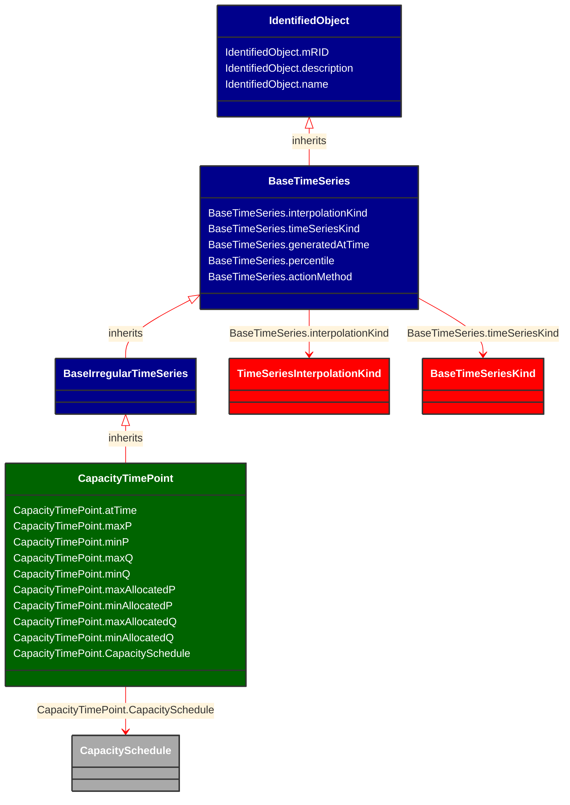

# CapacityTimePoint

__

**URI**: [nc:CapacityTimePoint](https://cim4.eu/ns/nc#CapacityTimePoint) 
**Type**: Class

## Inheritance
* [IdentifiedObject](IdentifiedObject.md)
    * [BaseTimeSeries](BaseTimeSeries.md)
        * [BaseIrregularTimeSeries](BaseIrregularTimeSeries.md)
            * **CapacityTimePoint**

## Attributes
| Name | URI | Cardinality and Range | Description | Inheritance |
| ---  | --- | --- | --- | --- |
| atTime | [nc:CapacityTimePoint.atTime](https://cim4.eu/ns/nc#CapacityTimePoint.atTime) | 0..1 DateTime |  | direct |
| maxP | [nc:CapacityTimePoint.maxP](https://cim4.eu/ns/nc#CapacityTimePoint.maxP) | 0..1 ActivePower |  | direct |
| minP | [nc:CapacityTimePoint.minP](https://cim4.eu/ns/nc#CapacityTimePoint.minP) | 0..1 ActivePower |  | direct |
| maxQ | [nc:CapacityTimePoint.maxQ](https://cim4.eu/ns/nc#CapacityTimePoint.maxQ) | 0..1 ReactivePower |  | direct |
| minQ | [nc:CapacityTimePoint.minQ](https://cim4.eu/ns/nc#CapacityTimePoint.minQ) | 0..1 ReactivePower |  | direct |
| maxAllocatedP | [nc:CapacityTimePoint.maxAllocatedP](https://cim4.eu/ns/nc#CapacityTimePoint.maxAllocatedP) | 0..1 ActivePower |  | direct |
| minAllocatedP | [nc:CapacityTimePoint.minAllocatedP](https://cim4.eu/ns/nc#CapacityTimePoint.minAllocatedP) | 0..1 ActivePower |  | direct |
| maxAllocatedQ | [nc:CapacityTimePoint.maxAllocatedQ](https://cim4.eu/ns/nc#CapacityTimePoint.maxAllocatedQ) | 0..1 ReactivePower |  | direct |
| minAllocatedQ | [nc:CapacityTimePoint.minAllocatedQ](https://cim4.eu/ns/nc#CapacityTimePoint.minAllocatedQ) | 0..1 ReactivePower |  | direct |
| CapacitySchedule | [nc:CapacityTimePoint.CapacitySchedule](https://cim4.eu/ns/nc#CapacityTimePoint.CapacitySchedule) | 0..1 CapacitySchedule |  | direct |
| interpolationKind | [nc:BaseTimeSeries.interpolationKind](https://cim4.eu/ns/nc#BaseTimeSeries.interpolationKind) | 0..1 TimeSeriesInterpolationKind |  | BaseTimeSeries |
| timeSeriesKind | [nc:BaseTimeSeries.timeSeriesKind](https://cim4.eu/ns/nc#BaseTimeSeries.timeSeriesKind) | 0..1 BaseTimeSeriesKind |  | BaseTimeSeries |
| generatedAtTime | [nc:BaseTimeSeries.generatedAtTime](https://cim4.eu/ns/nc#BaseTimeSeries.generatedAtTime) | 0..1 DateTime |  | BaseTimeSeries |
| percentile | [nc:BaseTimeSeries.percentile](https://cim4.eu/ns/nc#BaseTimeSeries.percentile) | 0..1 integer |  | BaseTimeSeries |
| actionMethod | [nc:BaseTimeSeries.actionMethod](https://cim4.eu/ns/nc#BaseTimeSeries.actionMethod) | 0..1 string |  | BaseTimeSeries |
| mRID | [cim:IdentifiedObject.mRID](https://cim.ucaiug.io/ns#IdentifiedObject.mRID) | 0..1 string | Master resource identifier issued by a model authority. The mRID is unique within an exchange context. Global uniqueness is easily achieved by using a UUID, as specified in RFC 4122, for the mRID. The use of UUID is strongly recommended.For CIMXML data files in RDF syntax conforming to IEC 61970-552, the mRID is mapped to rdf:ID or rdf:about attributes that identify CIM object elements. | IdentifiedObject |
| description | [cim:IdentifiedObject.description](https://cim.ucaiug.io/ns#IdentifiedObject.description) | 0..1 [LanguageObject](LanguageObject.md) or string | The description is a free human readable text describing or naming the object. It may be non unique and may not correlate to a naming hierarchy. | IdentifiedObject |
| name | [cim:IdentifiedObject.name](https://cim.ucaiug.io/ns#IdentifiedObject.name) | 0..1 string | The name is any free human readable and possibly non unique text naming the object. | IdentifiedObject |

### Schema Source
* from schema: [https://ap-no.cim4.eu/WattApp/1.0](https://ap-no.cim4.eu/WattApp/1.0)
