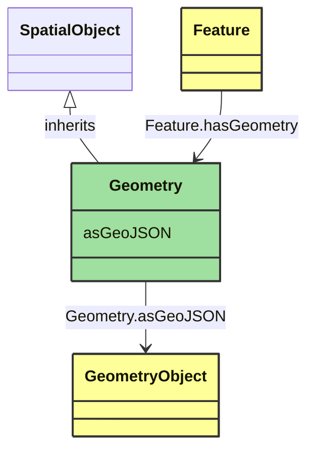

# Geometry

_Geometric representation details._

**URI**: [geo:Geometry](http://www.opengis.net/ont/geosparql#Geometry) 
**Type**: Class

## Inheritance
* [SpatialObject](SpatialObject.md)
    * **Geometry**

## Attributes
| Name | URI | Cardinality and Range | Description | Inheritance |
| ---  | --- | --- | --- | --- |
| asGeoJSON | [geo:asGeoJSON](http://www.opengis.net/ont/geosparql#asGeoJSON) | 0..1 GeometryObject | Geometric representation of the spatial object in GeoJSON format. | direct |

### Schema Source
* from schema: [https://ap-no.cim4.eu/WattApp/1.0](https://ap-no.cim4.eu/WattApp/1.0)
