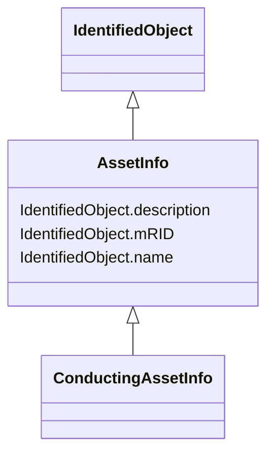

# AssetInfo

_Set of attributes of an asset, representing typical datasheet information of a physical device that can be instantiated and shared in different data exchange contexts:- as attributes of an asset instance (installed or in stock)- as attributes of an asset model (product by a manufacturer)- as attributes of a type asset (generic type of an asset as used in designs/extension planning)._

* __NOTE__: this is an abstract class and should not be instantiated directly

**URI**: [cim:AssetInfo](http://iec.ch/TC57/CIM-generic#AssetInfo) 
**Type**: Class

## Inheritance
* [IdentifiedObject](IdentifiedObject.md)
    * **AssetInfo**
        * [ConductingAssetInfo](ConductingAssetInfo.md)

## Attributes

| Name | URI | Cardinality and Range | Description | Inheritance |
| ---  | --- | --- | --- | --- |
| mRID | [cim:IdentifiedObject.mRID](http://iec.ch/TC57/CIM-generic#IdentifiedObject.mRID) | 0..1    string  | Master resource identifier issued by a model authority | [IdentifiedObject](IdentifiedObject.md) |
| description | [cim:IdentifiedObject.description](http://iec.ch/TC57/CIM-generic#IdentifiedObject.description) | 0..1    string  | The description is a free human readable text describing or naming the object | [IdentifiedObject](IdentifiedObject.md) |
| name | [cim:IdentifiedObject.name](http://iec.ch/TC57/CIM-generic#IdentifiedObject.name) | 0..1    string  | The name is any free human readable and possibly non unique text naming the o... | [IdentifiedObject](IdentifiedObject.md) |

## Usages

| used by | used in | type | used |
| ---  | --- | --- | --- |
| [ProductAssetModel](ProductAssetModel.md) | AssetInfo | range | [AssetInfo](AssetInfo.md) |

## Identifier and Mapping Information

### Schema Source

* from schema: http://iec.ch/TC57/2007/profile#

## Mappings

| Mapping Type | Mapped Value |
| ---  | ---  |
| self | cim:AssetInfo |
| native | this:AssetInfo |

