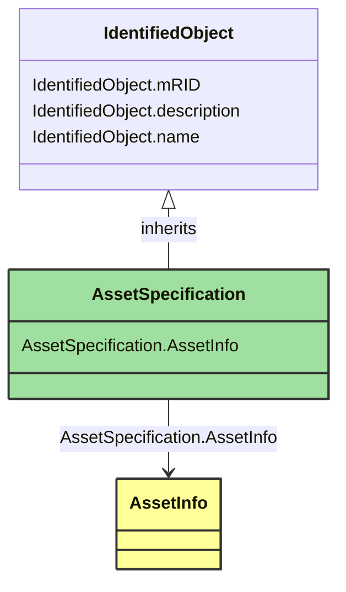

# AssetSpecification

_Specification can be used for various purposes relative to an asset, a logical device (PowerSystemResource), location, etc. Examples include documents supplied by manufacturers such as asset installation instructions, asset maintenance instructions, etc._

**URI**: [cim:AssetSpecification](http://iec.ch/TC57/CIM-generic#AssetSpecification) 
**Type**: Class

## Inheritance
* [IdentifiedObject](IdentifiedObject.md)
    * **AssetSpecification**

## Attributes
| Name | URI | Cardinality and Range | Description | Inheritance |
| ---  | --- | --- | --- | --- |
| AssetInfo | [cim:AssetSpecification.AssetInfo](http://iec.ch/TC57/CIM-generic#AssetSpecification.AssetInfo) | 0..1 | No description available | direct |
| mRID | [cim:IdentifiedObject.mRID](http://iec.ch/TC57/CIM-generic#IdentifiedObject.mRID) | 0..1 | Master resource identifier issued by a model authority. The mRID is unique within an exchange context. Global uniqueness is easily achieved by using a UUID, as specified in IETF RFC 4122, for the mRID. The use of UUID is strongly recommended.For CIMXML data files in RDF syntax conforming to IEC 61970-552, the mRID is mapped to rdf:ID or rdf:about attributes that identify CIM object elements. | IdentifiedObject |
| description | [cim:IdentifiedObject.description](http://iec.ch/TC57/CIM-generic#IdentifiedObject.description) | 0..1 | The description is a free human readable text describing or naming the object. It may be non unique and may not correlate to a naming hierarchy. | IdentifiedObject |
| name | [cim:IdentifiedObject.name](http://iec.ch/TC57/CIM-generic#IdentifiedObject.name) | 0..1 | The name is any free human readable and possibly non unique text naming the object. | IdentifiedObject |

### Schema Source
* from schema: [http://iec.ch/TC57/2007/profile#](http://iec.ch/TC57/2007/profile#)
