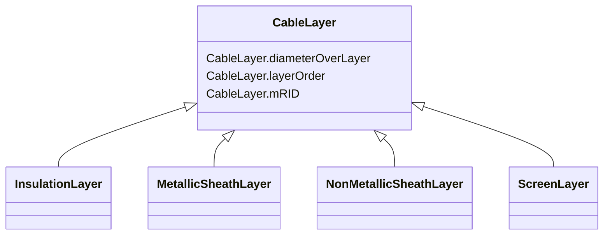

# CableLayer

* __NOTE__: this is an abstract class and should not be instantiated directly

**URI**: [cim:CableLayer](http://iec.ch/TC57/CIM-generic#CableLayer) 
**Type**: Class

## Inheritance
* **CableLayer**
    * [InsulationLayer](InsulationLayer.md)
    * [MetallicSheathLayer](MetallicSheathLayer.md)
    * [NonMetallicSheathLayer](NonMetallicSheathLayer.md)
    * [ScreenLayer](ScreenLayer.md)

## Attributes

| Name | URI | Cardinality and Range | Description | Inheritance |
| ---  | --- | --- | --- | --- |
| mRID | [cim:CableLayer.mRID](http://iec.ch/TC57/CIM-generic#CableLayer.mRID) | 0..1    string  | Master resource identifier issued by a model authority | direct |
| diameterOverLayer | [cim:CableLayer.diameterOverLayer](http://iec.ch/TC57/CIM-generic#CableLayer.diameterOverLayer) | 0..1    [Length](Length.md)  | Use either diameter over layer or layer thickness | direct |
| layerOrder | [cim:CableLayer.layerOrder](http://iec.ch/TC57/CIM-generic#CableLayer.layerOrder) | 0..1    integer  | Order of the layer outwards from the cable core | direct |

## Usages

| used by | used in | type | used |
| ---  | --- | --- | --- |
| [CableInfo](CableInfo.md) | Layer | range | [CableLayer](CableLayer.md) |
| [MultiCoreCableInfo](MultiCoreCableInfo.md) | BeltedLayer | range | [CableLayer](CableLayer.md) |
| [MultiCoreCableInfo](MultiCoreCableInfo.md) | Layer | range | [CableLayer](CableLayer.md) |

## Identifier and Mapping Information

### Schema Source

* from schema: http://iec.ch/TC57/2007/profile#

## Mappings

| Mapping Type | Mapped Value |
| ---  | ---  |
| self | cim:CableLayer |
| native | this:CableLayer |

