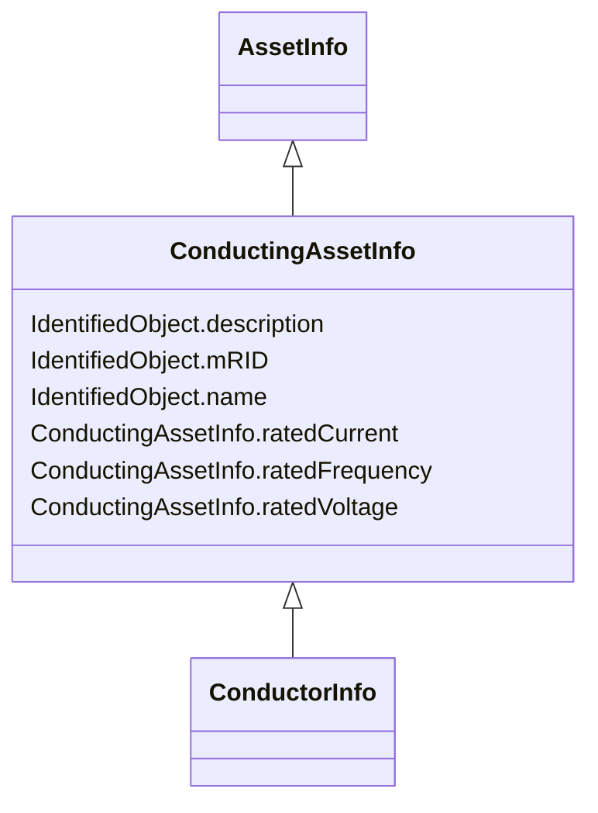

# ConductingAssetInfo

_Generic information for conducting asset_

* __NOTE__: this is an abstract class and should not be instantiated directly

**URI**: [cim:ConductingAssetInfo](http://iec.ch/TC57/CIM-generic#ConductingAssetInfo) 
**Type**: Class

## Inheritance
* [IdentifiedObject](IdentifiedObject.md)
    * [AssetInfo](AssetInfo.md)
        * **ConductingAssetInfo**
            * [ConductorInfo](ConductorInfo.md)

## Attributes

| Name | URI | Cardinality and Range | Description | Inheritance |
| ---  | --- | --- | --- | --- |
| ratedCurrent | [cim:ConductingAssetInfo.ratedCurrent](http://iec.ch/TC57/CIM-generic#ConductingAssetInfo.ratedCurrent) | 0..1    [CurrentFlow](CurrentFlow.md)  | Rated current | direct |
| ratedFrequency | [cim:ConductingAssetInfo.ratedFrequency](http://iec.ch/TC57/CIM-generic#ConductingAssetInfo.ratedFrequency) | 0..1    [Frequency](Frequency.md)  | Rated frequency such as 50Hz or 60Hz | direct |
| ratedVoltage | [cim:ConductingAssetInfo.ratedVoltage](http://iec.ch/TC57/CIM-generic#ConductingAssetInfo.ratedVoltage) | 0..1    [Voltage](Voltage.md)  | Rated voltage | direct |
| mRID | [cim:IdentifiedObject.mRID](http://iec.ch/TC57/CIM-generic#IdentifiedObject.mRID) | 0..1    string  | Master resource identifier issued by a model authority | [IdentifiedObject](IdentifiedObject.md) |
| description | [cim:IdentifiedObject.description](http://iec.ch/TC57/CIM-generic#IdentifiedObject.description) | 0..1    string  | The description is a free human readable text describing or naming the object | [IdentifiedObject](IdentifiedObject.md) |
| name | [cim:IdentifiedObject.name](http://iec.ch/TC57/CIM-generic#IdentifiedObject.name) | 0..1    string  | The name is any free human readable and possibly non unique text naming the o... | [IdentifiedObject](IdentifiedObject.md) |

## Identifier and Mapping Information

### Schema Source

* from schema: http://iec.ch/TC57/2007/profile#

## Mappings

| Mapping Type | Mapped Value |
| ---  | ---  |
| self | cim:ConductingAssetInfo |
| native | this:ConductingAssetInfo |

