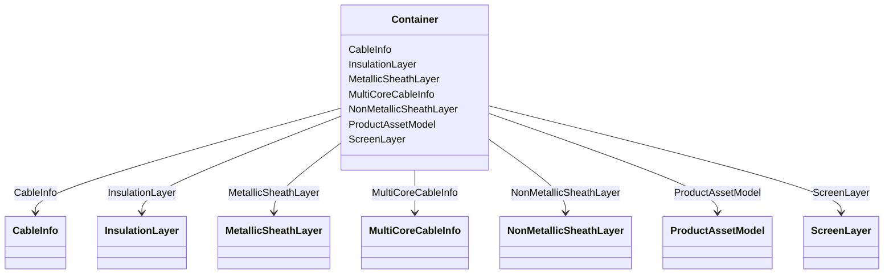

# Container

**URI**: [this:Container](http://iec.ch/TC57/2007/profile#Container) 
**Type**: Class

<!-- no inheritance hierarchy -->

## Attributes

| Name | URI | Cardinality and Range | Description | Inheritance |
| ---  | --- | --- | --- | --- |
| CableInfo | [this:CableInfo](http://iec.ch/TC57/2007/profile#CableInfo) | 0..*    [CableInfo](CableInfo.md)  |  | direct |
| MultiCoreCableInfo | [this:MultiCoreCableInfo](http://iec.ch/TC57/2007/profile#MultiCoreCableInfo) | 0..*    [MultiCoreCableInfo](MultiCoreCableInfo.md)  |  | direct |
| ProductAssetModel | [this:ProductAssetModel](http://iec.ch/TC57/2007/profile#ProductAssetModel) | 0..*    [ProductAssetModel](ProductAssetModel.md)  |  | direct |
| InsulationLayer | [this:InsulationLayer](http://iec.ch/TC57/2007/profile#InsulationLayer) | 0..*    [InsulationLayer](InsulationLayer.md)  |  | direct |
| MetallicSheathLayer | [this:MetallicSheathLayer](http://iec.ch/TC57/2007/profile#MetallicSheathLayer) | 0..*    [MetallicSheathLayer](MetallicSheathLayer.md)  |  | direct |
| ScreenLayer | [this:ScreenLayer](http://iec.ch/TC57/2007/profile#ScreenLayer) | 0..*    [ScreenLayer](ScreenLayer.md)  |  | direct |
| NonMetallicSheathLayer | [this:NonMetallicSheathLayer](http://iec.ch/TC57/2007/profile#NonMetallicSheathLayer) | 0..*    [NonMetallicSheathLayer](NonMetallicSheathLayer.md)  |  | direct |

## Identifier and Mapping Information

### Schema Source

* from schema: http://iec.ch/TC57/2007/profile#

## Mappings

| Mapping Type | Mapped Value |
| ---  | ---  |
| self | this:Container |
| native | this:Container |

