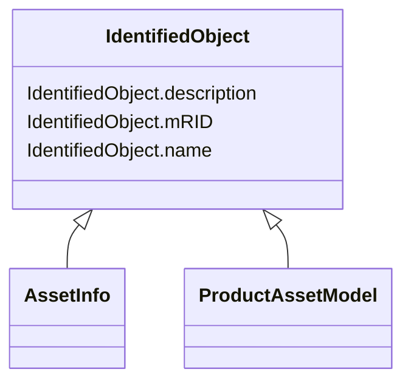

# IdentifiedObject

_This is a root class to provide common identification for all classes needing identification and naming attributes._

* __NOTE__: this is an abstract class and should not be instantiated directly

**URI**: [cim:IdentifiedObject](http://iec.ch/TC57/CIM-generic#IdentifiedObject) 
**Type**: Class

## Inheritance
* **IdentifiedObject**
    * [AssetInfo](AssetInfo.md)
    * [ProductAssetModel](ProductAssetModel.md)

## Attributes

| Name | URI | Cardinality and Range | Description | Inheritance |
| ---  | --- | --- | --- | --- |
| mRID | [cim:IdentifiedObject.mRID](http://iec.ch/TC57/CIM-generic#IdentifiedObject.mRID) | 0..1    string  | Master resource identifier issued by a model authority | direct |
| description | [cim:IdentifiedObject.description](http://iec.ch/TC57/CIM-generic#IdentifiedObject.description) | 0..1    string  | The description is a free human readable text describing or naming the object | direct |
| name | [cim:IdentifiedObject.name](http://iec.ch/TC57/CIM-generic#IdentifiedObject.name) | 0..1    string  | The name is any free human readable and possibly non unique text naming the o... | direct |

## Identifier and Mapping Information

### Schema Source

* from schema: http://iec.ch/TC57/2007/profile#

## Mappings

| Mapping Type | Mapped Value |
| ---  | ---  |
| self | cim:IdentifiedObject |
| native | this:IdentifiedObject |

