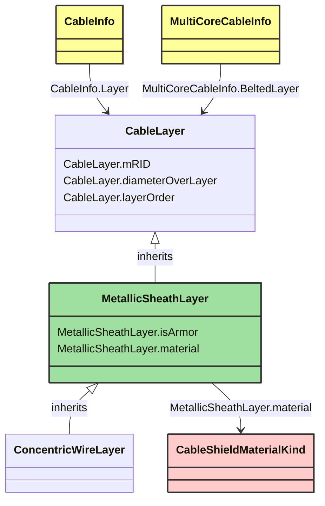

# MetallicSheathLayer

_Any metallic sheath (or metal screen), including foils, braids, armours, concentric neutrals and tape shields._

**URI**: [cim:MetallicSheathLayer](http://iec.ch/TC57/CIM-generic#MetallicSheathLayer) 
**Type**: Class

## Inheritance
* [CableLayer](CableLayer.md)
    * **MetallicSheathLayer**

## Attributes
| Name | URI | Cardinality and Range | Description | Inheritance |
| ---  | --- | --- | --- | --- |
| isArmor | [cim:MetallicSheathLayer.isArmor](http://iec.ch/TC57/CIM-generic#MetallicSheathLayer.isArmor) | 0..1 | Indicates whether this metallic sheath is an armor, which is a covering consisting of a metal tape(s) or wires, generally used to protect the cable from external mechanical effects | direct |
| material | [cim:MetallicSheathLayer.material](http://iec.ch/TC57/CIM-generic#MetallicSheathLayer.material) | 0..1 | Material og this metallic sheath layer. | direct |
| mRID | [cim:CableLayer.mRID](http://iec.ch/TC57/CIM-generic#CableLayer.mRID) | 0..1 | Master resource identifier issued by a model authority. The mRID is unique within an exchange context. Global uniqueness is easily achieved by using a UUID, as specified in IETF RFC 4122, for the mRID. The use of UUID is strongly recommended.For CIMXML data files in RDF syntax conforming to IEC 61970-552, the mRID is mapped to rdf:ID or rdf:about attributes that identify CIM object elements. | CableLayer |
| diameterOverLayer | [cim:CableLayer.diameterOverLayer](http://iec.ch/TC57/CIM-generic#CableLayer.diameterOverLayer) | 0..1 | Use either diameter over layer or layer thickness.Specification varies by manufacturer and manufacturing process. For extruded layers, the diameter is typically provided. For tapes, the thickness is typically applied. | CableLayer |
| layerOrder | [cim:CableLayer.layerOrder](http://iec.ch/TC57/CIM-generic#CableLayer.layerOrder) | 0..1 | Order of the layer outwards from the cable core.For a multi-core cable, belted layers must have their own order starting from the first belted layer.Intercalated layers (typically tapes, where each tape is both below and above the other tape) must share the same layer order. | CableLayer |

### Schema Source
* from schema: [http://iec.ch/TC57/2007/profile#](http://iec.ch/TC57/2007/profile#)
