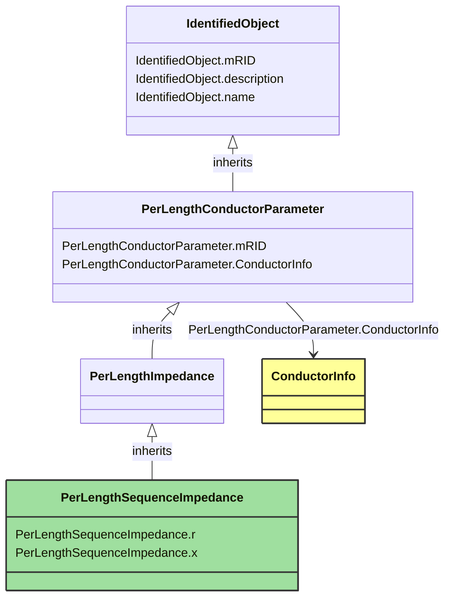

# PerLengthSequenceImpedance

_Sequence impedance and admittance parameters per unit length, for transposed lines of 1, 2, or 3 phases. For 1-phase lines, define x=x0=xself. For 2-phase lines, define x=xs-xm and x0=xs+xm._

**URI**: [cim:PerLengthSequenceImpedance](http://iec.ch/TC57/CIM-generic#PerLengthSequenceImpedance) 
**Type**: Class

## Inheritance
* [IdentifiedObject](IdentifiedObject.md)
    * [PerLengthConductorParameter](PerLengthConductorParameter.md)
        * [PerLengthImpedance](PerLengthImpedance.md)
            * **PerLengthSequenceImpedance**

## Attributes
| Name | URI | Cardinality and Range | Description | Inheritance |
| ---  | --- | --- | --- | --- |
| r | [cim:PerLengthSequenceImpedance.r](http://iec.ch/TC57/CIM-generic#PerLengthSequenceImpedance.r) | 0..1 ResistancePerLength | Positive sequence series resistance, per unit of length. | direct |
| x | [cim:PerLengthSequenceImpedance.x](http://iec.ch/TC57/CIM-generic#PerLengthSequenceImpedance.x) | 0..1 ReactancePerLength | Positive sequence series reactance, per unit of length. | direct |
| mRID | [cim:PerLengthConductorParameter.mRID](http://iec.ch/TC57/CIM-generic#PerLengthConductorParameter.mRID) | 0..1 string | Master resource identifier issued by a model authority. The mRID is unique within an exchange context. Global uniqueness is easily achieved by using a UUID, as specified in IETF RFC 4122, for the mRID. The use of UUID is strongly recommended.For CIMXML data files in RDF syntax conforming to IEC 61970-552, the mRID is mapped to rdf:ID or rdf:about attributes that identify CIM object elements. | PerLengthConductorParameter |
| ConductorInfo | [cim:PerLengthConductorParameter.ConductorInfo](http://iec.ch/TC57/CIM-generic#PerLengthConductorParameter.ConductorInfo) | 0..1 ConductorInfo | No description available | PerLengthConductorParameter |
| mRID | [cim:IdentifiedObject.mRID](http://iec.ch/TC57/CIM-generic#IdentifiedObject.mRID) | 0..1 string | Master resource identifier issued by a model authority. The mRID is unique within an exchange context. Global uniqueness is easily achieved by using a UUID, as specified in IETF RFC 4122, for the mRID. The use of UUID is strongly recommended.For CIMXML data files in RDF syntax conforming to IEC 61970-552, the mRID is mapped to rdf:ID or rdf:about attributes that identify CIM object elements. | IdentifiedObject |
| description | [cim:IdentifiedObject.description](http://iec.ch/TC57/CIM-generic#IdentifiedObject.description) | 0..1 string | The description is a free human readable text describing or naming the object. It may be non unique and may not correlate to a naming hierarchy. | IdentifiedObject |
| name | [cim:IdentifiedObject.name](http://iec.ch/TC57/CIM-generic#IdentifiedObject.name) | 0..1 string | The name is any free human readable and possibly non unique text naming the object. | IdentifiedObject |

### Schema Source
* from schema: [http://iec.ch/TC57/2007/profile](http://iec.ch/TC57/2007/profile)
