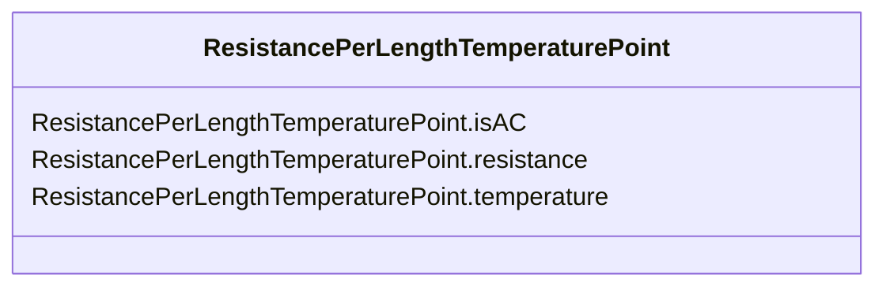

# ResistancePerLengthTemperaturePoint

**URI**: [cim:ResistancePerLengthTemperaturePoint](http://iec.ch/TC57/CIM-generic#ResistancePerLengthTemperaturePoint) 
**Type**: Class

<!-- no inheritance hierarchy -->

## Attributes

| Name | URI | Cardinality and Range | Description | Inheritance |
| ---  | --- | --- | --- | --- |
| isAC | [cim:ResistancePerLengthTemperaturePoint.isAC](http://iec.ch/TC57/CIM-generic#ResistancePerLengthTemperaturePoint.isAC) | 0..1    boolean  |  | direct |
| resistance | [cim:ResistancePerLengthTemperaturePoint.resistance](http://iec.ch/TC57/CIM-generic#ResistancePerLengthTemperaturePoint.resistance) | 0..1    [ResistancePerLength](ResistancePerLength.md)  |  | direct |
| temperature | [cim:ResistancePerLengthTemperaturePoint.temperature](http://iec.ch/TC57/CIM-generic#ResistancePerLengthTemperaturePoint.temperature) | 0..1    [Temperature](Temperature.md)  |  | direct |

## Usages

| used by | used in | type | used |
| ---  | --- | --- | --- |
| [CableInfo](CableInfo.md) | ConductorPerLengthResistance | range | [ResistancePerLengthTemperaturePoint](ResistancePerLengthTemperaturePoint.md) |
| [ConductorInfo](ConductorInfo.md) | ConductorPerLengthResistance | range | [ResistancePerLengthTemperaturePoint](ResistancePerLengthTemperaturePoint.md) |
| [MetallicSheathLayer](MetallicSheathLayer.md) | LayerResistance | range | [ResistancePerLengthTemperaturePoint](ResistancePerLengthTemperaturePoint.md) |
| [MultiCoreCableInfo](MultiCoreCableInfo.md) | ConductorPerLengthResistance | range | [ResistancePerLengthTemperaturePoint](ResistancePerLengthTemperaturePoint.md) |
| [WireInfo](WireInfo.md) | ConductorPerLengthResistance | range | [ResistancePerLengthTemperaturePoint](ResistancePerLengthTemperaturePoint.md) |

## Identifier and Mapping Information

### Schema Source

* from schema: http://iec.ch/TC57/2007/profile#

## Mappings

| Mapping Type | Mapped Value |
| ---  | ---  |
| self | cim:ResistancePerLengthTemperaturePoint |
| native | this:ResistancePerLengthTemperaturePoint |

