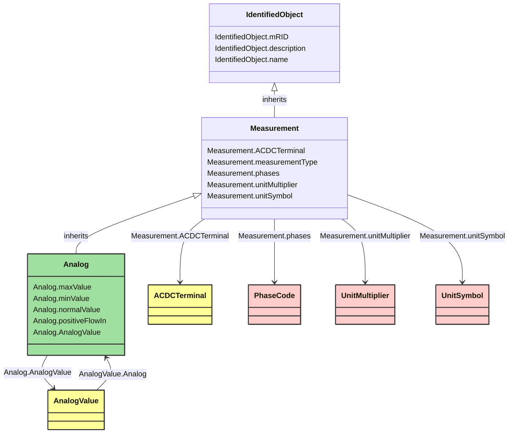

# Analog

_Analog represents an analog Measurement._

**URI**: [cim:Analog](https://cim.ucaiug.io/ns#Analog) 
**Type**: Class

## Inheritance
* [IdentifiedObject](IdentifiedObject.md)
    * [Measurement](Measurement.md)
        * **Analog**

## Attributes
| Name | URI | Cardinality and Range | Description | Inheritance |
| ---  | --- | --- | --- | --- |
| maxValue | [cim:Analog.maxValue](https://cim.ucaiug.io/ns#Analog.maxValue) | 0..1 Float | Normal value range maximum for any of the MeasurementValue.values. Used for scaling, e.g. in bar graphs or of telemetered raw values. | direct |
| minValue | [cim:Analog.minValue](https://cim.ucaiug.io/ns#Analog.minValue) | 0..1 Float | Normal value range minimum for any of the MeasurementValue.values. Used for scaling, e.g. in bar graphs or of telemetered raw values. | direct |
| normalValue | [cim:Analog.normalValue](https://cim.ucaiug.io/ns#Analog.normalValue) | 0..1 Float | Normal measurement value, e.g., used for percentage calculations. | direct |
| positiveFlowIn | [cim:Analog.positiveFlowIn](https://cim.ucaiug.io/ns#Analog.positiveFlowIn) | 0..1 Boolean | If true then this measurement is an active power, reactive power or current with the convention that a positive value measured at the Terminal means power is flowing into the related PowerSystemResource. | direct |
| AnalogValue | [cim:Analog.AnalogValue](https://cim.ucaiug.io/ns#Analog.AnalogValue) | 0..1 AnalogValue | The values connected to this measurement. | direct |
| ACDCTerminal | [cim:Measurement.ACDCTerminal](https://cim.ucaiug.io/ns#Measurement.ACDCTerminal) | 0..1 ACDCTerminal | One or more measurements may be associated with a terminal in the network. | Measurement |
| measurementType | [cim:Measurement.measurementType](https://cim.ucaiug.io/ns#Measurement.measurementType) | 0..1 String | Specifies the type of measurement. For example, this specifies if the measurement represents an indoor temperature, outdoor temperature, bus voltage, line flow, etc.
When the measurementType is set to "Specialization", the type of Measurement is defined in more detail by the specialized class which inherits from Measurement. | Measurement |
| phases | [cim:Measurement.phases](https://cim.ucaiug.io/ns#Measurement.phases) | 0..1 PhaseCode | Indicates to which phases the measurement applies and avoids the need to use 'measurementType' to also encode phase information (which would explode the types). The phase information in Measurement, along with 'measurementType' and 'phases' uniquely defines a Measurement for a device, based on normal network phase. Their meaning will not change when the computed energizing phasing is changed due to jumpers or other reasons.
If the attribute is missing three phases (ABC) shall be assumed. | Measurement |
| unitMultiplier | [cim:Measurement.unitMultiplier](https://cim.ucaiug.io/ns#Measurement.unitMultiplier) | 0..1 UnitMultiplier | The unit multiplier of the measured quantity. | Measurement |
| unitSymbol | [cim:Measurement.unitSymbol](https://cim.ucaiug.io/ns#Measurement.unitSymbol) | 0..1 UnitSymbol | The unit of measure of the measured quantity. | Measurement |
| mRID | [cim:IdentifiedObject.mRID](https://cim.ucaiug.io/ns#IdentifiedObject.mRID) | 0..1 string | Master resource identifier issued by a model authority. The mRID is unique within an exchange context. Global uniqueness is easily achieved by using a UUID, as specified in RFC 4122, for the mRID. The use of UUID is strongly recommended.For CIMXML data files in RDF syntax conforming to IEC 61970-552, the mRID is mapped to rdf:ID or rdf:about attributes that identify CIM object elements. | IdentifiedObject |
| description | [cim:IdentifiedObject.description](https://cim.ucaiug.io/ns#IdentifiedObject.description) | 0..1 [LanguageObject](LanguageObject.md) or string | The description is a free human readable text describing or naming the object. It may be non unique and may not correlate to a naming hierarchy. | IdentifiedObject |
| name | [cim:IdentifiedObject.name](https://cim.ucaiug.io/ns#IdentifiedObject.name) | 0..1 string | The name is any free human readable and possibly non unique text naming the object. | IdentifiedObject |

### Schema Source
* from schema: [https://ap-no.cim4.eu/WattApp/1.0](https://ap-no.cim4.eu/WattApp/1.0)
