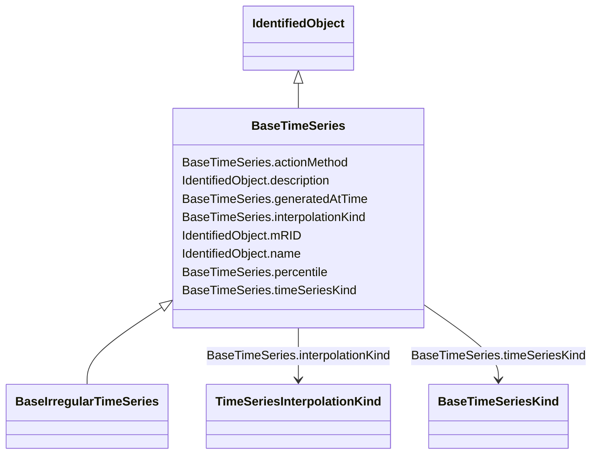

# BaseTimeSeries

* __NOTE__: this is an abstract class and should not be instantiated directly

**URI**: [cim:BaseTimeSeries](https://cim.ucaiug.io/ns#BaseTimeSeries) 
**Type**: Class

## Inheritance
* [IdentifiedObject](IdentifiedObject.md)
    * **BaseTimeSeries**
        * [BaseIrregularTimeSeries](BaseIrregularTimeSeries.md)

## Attributes

| Name | URI | Cardinality and Range | Description | Inheritance |
| ---  | --- | --- | --- | --- |
| interpolationKind | [nc:BaseTimeSeries.interpolationKind](https://cim4.eu/ns/nc#BaseTimeSeries.interpolationKind) | 0..1    [TimeSeriesInterpolationKind](TimeSeriesInterpolationKind.md)  |  | direct |
| timeSeriesKind | [nc:BaseTimeSeries.timeSeriesKind](https://cim4.eu/ns/nc#BaseTimeSeries.timeSeriesKind) | 0..1    [BaseTimeSeriesKind](BaseTimeSeriesKind.md)  |  | direct |
| generatedAtTime | [nc:BaseTimeSeries.generatedAtTime](https://cim4.eu/ns/nc#BaseTimeSeries.generatedAtTime) | 0..1    [DateTime](DateTime.md)  |  | direct |
| percentile | [nc:BaseTimeSeries.percentile](https://cim4.eu/ns/nc#BaseTimeSeries.percentile) | 0..1    integer  |  | direct |
| actionMethod | [nc:BaseTimeSeries.actionMethod](https://cim4.eu/ns/nc#BaseTimeSeries.actionMethod) | 0..1    string  |  | direct |
| mRID | [cim:IdentifiedObject.mRID](https://cim.ucaiug.io/ns#IdentifiedObject.mRID) | 0..1    string  | Master resource identifier issued by a model authority | [IdentifiedObject](IdentifiedObject.md) |
| description | [cim:IdentifiedObject.description](https://cim.ucaiug.io/ns#IdentifiedObject.description) | 0..1    string  | The description is a free human readable text describing or naming the object | [IdentifiedObject](IdentifiedObject.md) |
| name | [cim:IdentifiedObject.name](https://cim.ucaiug.io/ns#IdentifiedObject.name) | 0..1    string  | The name is any free human readable and possibly non unique text naming the o... | [IdentifiedObject](IdentifiedObject.md) |

## Identifier and Mapping Information

### Schema Source

* from schema: https://ap-no.cim4.eu/WattApp/1.0

## Mappings

| Mapping Type | Mapped Value |
| ---  | ---  |
| self | cim:BaseTimeSeries |
| native | this:BaseTimeSeries |

