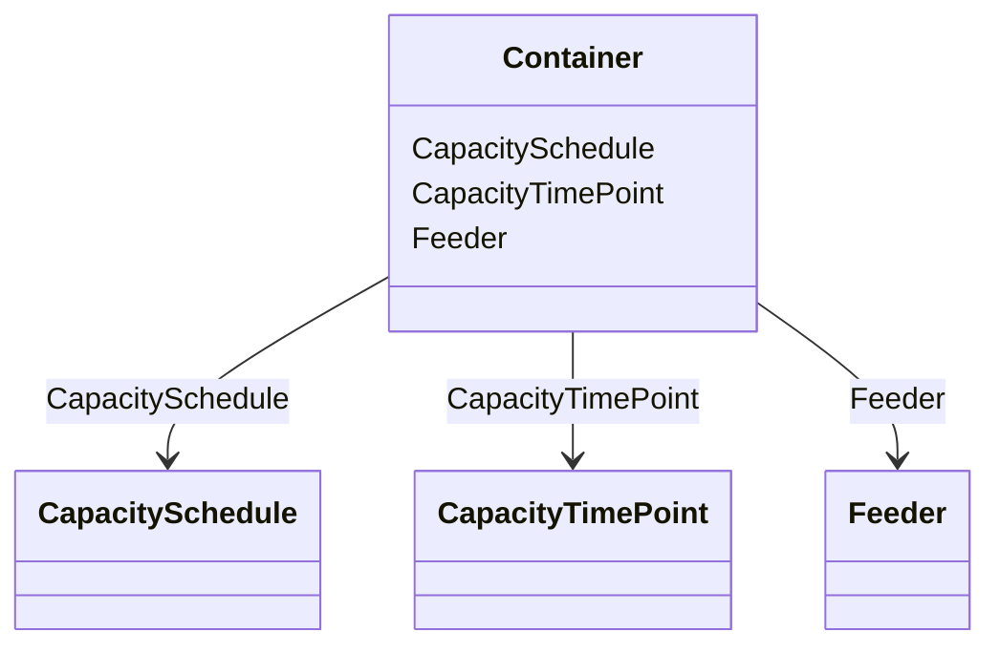

# Container

**URI**: [this:Container](https://ap-no.cim4.eu/WattApp/1.0#Container) 
**Type**: Class

<!-- no inheritance hierarchy -->

## Attributes

| Name | URI | Cardinality and Range | Description | Inheritance |
| ---  | --- | --- | --- | --- |
| Feeder | [this:Feeder](https://ap-no.cim4.eu/WattApp/1.0#Feeder) | 0..*    [Feeder](Feeder.md)  |  | direct |
| CapacitySchedule | [this:CapacitySchedule](https://ap-no.cim4.eu/WattApp/1.0#CapacitySchedule) | 0..*    [CapacitySchedule](CapacitySchedule.md)  |  | direct |
| CapacityTimePoint | [this:CapacityTimePoint](https://ap-no.cim4.eu/WattApp/1.0#CapacityTimePoint) | 0..*    [CapacityTimePoint](CapacityTimePoint.md)  |  | direct |

## Identifier and Mapping Information

### Schema Source

* from schema: https://ap-no.cim4.eu/WattApp/1.0

## Mappings

| Mapping Type | Mapped Value |
| ---  | ---  |
| self | this:Container |
| native | this:Container |

