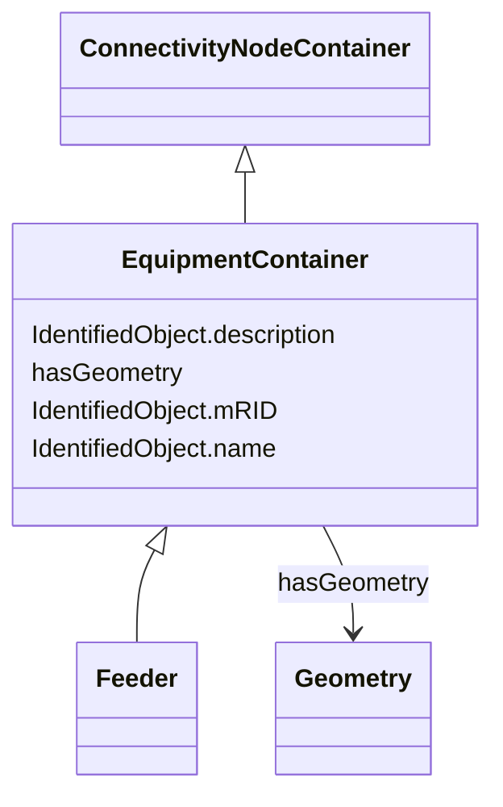

# EquipmentContainer

_A modelling construct to provide a root class for containing equipment._

* __NOTE__: this is an abstract class and should not be instantiated directly

**URI**: [cim:EquipmentContainer](http://iec.ch/TC57/CIM100#EquipmentContainer) 
**Type**: Class

## Inheritance
* [IdentifiedObject](IdentifiedObject.md)
    * [PowerSystemResource](PowerSystemResource.md) [ [Feature](Feature.md)]
        * [ConnectivityNodeContainer](ConnectivityNodeContainer.md)
            * **EquipmentContainer**
                * [Feeder](Feeder.md)

## Attributes

| Name | URI | Cardinality and Range | Description | Inheritance |
| ---  | --- | --- | --- | --- |
| hasGeometry | [geo:hasGeometry](http://www.opengis.net/ont/geosparql#hasGeometry) | 0..1    [Geometry](Geometry.md)  | Geometric representation of the spatial object | [Feature](Feature.md) |
| mRID | [cim:IdentifiedObject.mRID](http://iec.ch/TC57/CIM100#IdentifiedObject.mRID) | 0..1    string  | Master resource identifier issued by a model authority | [IdentifiedObject](IdentifiedObject.md) |
| description | [cim:IdentifiedObject.description](http://iec.ch/TC57/CIM100#IdentifiedObject.description) | 0..1    string  | The description is a free human readable text describing or naming the object | [IdentifiedObject](IdentifiedObject.md) |
| name | [cim:IdentifiedObject.name](http://iec.ch/TC57/CIM100#IdentifiedObject.name) | 0..1    string  | The name is any free human readable and possibly non unique text naming the o... | [IdentifiedObject](IdentifiedObject.md) |

## Identifier and Mapping Information

### Schema Source

* from schema: https://ap-no.cim4.eu/WattApp/1.0

## Mappings

| Mapping Type | Mapped Value |
| ---  | ---  |
| self | cim:EquipmentContainer |
| native | this:EquipmentContainer |

