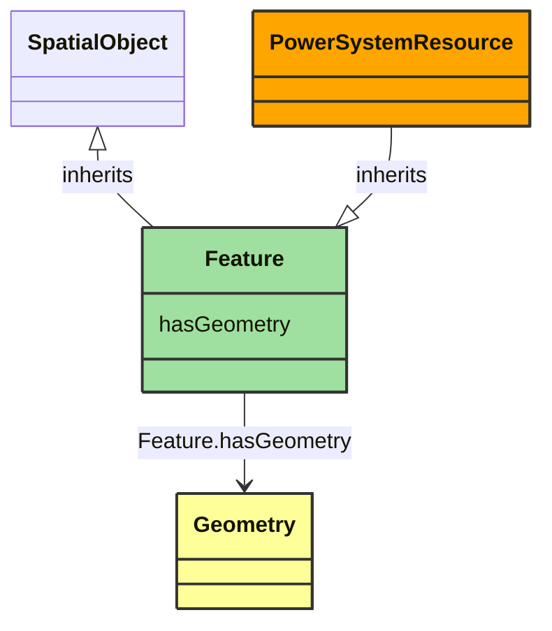

# Feature

_Defines a system base voltage which is referenced._

**URI**: [geo:Feature](http://www.opengis.net/ont/geosparql#Feature) 
**Type**: Class

## Inheritance
* [SpatialObject](SpatialObject.md)
    * **Feature**

## Attributes
| Name | URI | Cardinality and Range | Description | Inheritance |
| ---  | --- | --- | --- | --- |
| hasGeometry | [geo:hasGeometry](http://www.opengis.net/ont/geosparql#hasGeometry) | 0..1 | Geometric representation of the spatial object. | direct |

### Schema Source
* from schema: [https://ap-no.cim4.eu/WattApp/1.0](https://ap-no.cim4.eu/WattApp/1.0)
