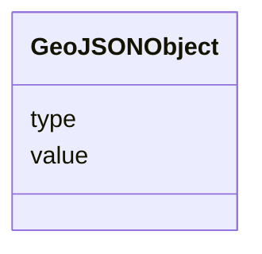

# GeoJSONObject

_An object that represents a GeoJSON object with a value and type._

**URI**: [this:GeoJSONObject](https://ap-no.cim4.eu/WattApp/1.0#GeoJSONObject) 
**Type**: Class

<!-- no inheritance hierarchy -->

## Attributes

| Name | URI | Cardinality and Range | Description | Inheritance |
| ---  | --- | --- | --- | --- |
| value | [this:value](https://ap-no.cim4.eu/WattApp/1.0#value) | 0..1    string  | A string representing the GeoJSON object, typically serialized as a string | direct |
| type | [this:type](https://ap-no.cim4.eu/WattApp/1.0#type) | 0..1    string  | The type of the GeoJSON object, e | direct |

## Usages

| used by | used in | type | used |
| ---  | --- | --- | --- |
| [Geometry](Geometry.md) | asGeoJSON | range | [GeoJSONObject](GeoJSONObject.md) |

## Identifier and Mapping Information

### Schema Source

* from schema: https://ap-no.cim4.eu/WattApp/1.0

## Mappings

| Mapping Type | Mapped Value |
| ---  | ---  |
| self | this:GeoJSONObject |
| native | this:GeoJSONObject |

