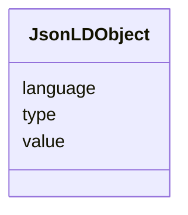

# JsonLDObject

_An object that represents a jsonld compound to support value, type and language._

**URI**: [this:JsonLDObject](https://ap-no.cim4.eu/WattApp/1.0#JsonLDObject) 
**Type**: Class

<!-- no inheritance hierarchy -->

## Attributes

| Name | URI | Cardinality and Range | Description | Inheritance |
| ---  | --- | --- | --- | --- |
| value | [this:value](https://ap-no.cim4.eu/WattApp/1.0#value) | 0..1    string  | A string representing the GeoJSON object, typically serialized as a string | direct |
| type | [this:type](https://ap-no.cim4.eu/WattApp/1.0#type) | 0..1    string  | The type of the GeoJSON object, e | direct |
| language | [this:language](https://ap-no.cim4.eu/WattApp/1.0#language) | 0..1    string  | The type of the GeoJSON object, e | direct |

## Usages

| used by | used in | type | used |
| ---  | --- | --- | --- |
| [IdentifiedObject](IdentifiedObject.md) | description | any_of[range] | [JsonLDObject](JsonLDObject.md) |
| [Geometry](Geometry.md) | asGeoJSON | range | [JsonLDObject](JsonLDObject.md) |
| [PowerSystemResource](PowerSystemResource.md) | description | any_of[range] | [JsonLDObject](JsonLDObject.md) |
| [ConnectivityNodeContainer](ConnectivityNodeContainer.md) | description | any_of[range] | [JsonLDObject](JsonLDObject.md) |
| [EquipmentContainer](EquipmentContainer.md) | description | any_of[range] | [JsonLDObject](JsonLDObject.md) |
| [Feeder](Feeder.md) | description | any_of[range] | [JsonLDObject](JsonLDObject.md) |
| [BaseTimeSeries](BaseTimeSeries.md) | description | any_of[range] | [JsonLDObject](JsonLDObject.md) |
| [BaseIrregularTimeSeries](BaseIrregularTimeSeries.md) | description | any_of[range] | [JsonLDObject](JsonLDObject.md) |
| [CapacitySchedule](CapacitySchedule.md) | description | any_of[range] | [JsonLDObject](JsonLDObject.md) |
| [CapacityTimePoint](CapacityTimePoint.md) | description | any_of[range] | [JsonLDObject](JsonLDObject.md) |

## Identifier and Mapping Information

### Schema Source

* from schema: https://ap-no.cim4.eu/WattApp/1.0

## Mappings

| Mapping Type | Mapped Value |
| ---  | ---  |
| self | this:JsonLDObject |
| native | this:JsonLDObject |

