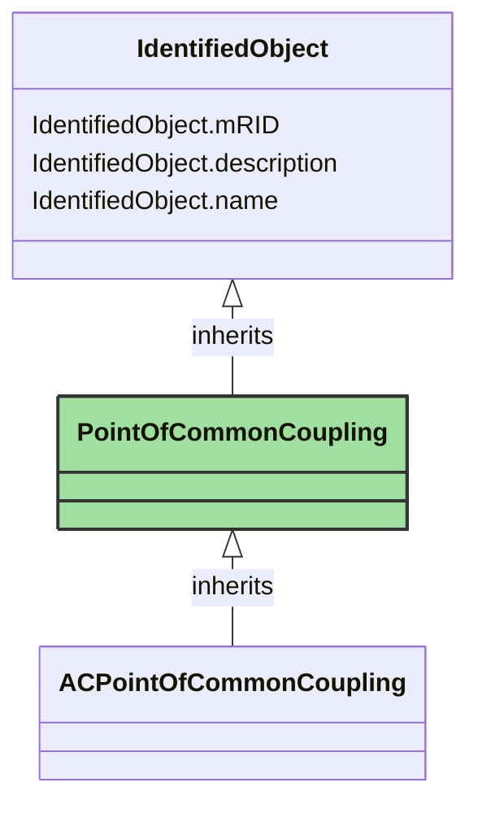

# PointOfCommonCoupling

_Point of Common Coupling (PCC) refers to the location where multiple electrical sources or loads are electrically connected and provide a reference point where the voltages and currents from different parts of the system are considered to be common. The PCC is used to support system analysis, control, and monitoring, as it provides a reference for understanding the interactions and power flow between various components within the system. It is also relevant to define the requirement and responsibility between different actors in operating a power system._

*__NOTE__: this is an abstract class and should not be instantiated directly

**URI**: [nc:PointOfCommonCoupling](https://cim4.eu/ns/nc#PointOfCommonCoupling) 
**Type**: Class

## Inheritance
* [IdentifiedObject](IdentifiedObject.md)
    * **PointOfCommonCoupling**

## Attributes
| Name | URI | Cardinality and Range | Description | Inheritance |
| ---  | --- | --- | --- | --- |
| mRID | [cim:IdentifiedObject.mRID](https://cim.ucaiug.io/ns#IdentifiedObject.mRID) | 0..1 string | Master resource identifier issued by a model authority. The mRID is unique within an exchange context. Global uniqueness is easily achieved by using a UUID, as specified in RFC 4122, for the mRID. The use of UUID is strongly recommended.For CIMXML data files in RDF syntax conforming to IEC 61970-552, the mRID is mapped to rdf:ID or rdf:about attributes that identify CIM object elements. | IdentifiedObject |
| description | [cim:IdentifiedObject.description](https://cim.ucaiug.io/ns#IdentifiedObject.description) | 0..1 [LanguageObject](LanguageObject.md) or string | The description is a free human readable text describing or naming the object. It may be non unique and may not correlate to a naming hierarchy. | IdentifiedObject |
| name | [cim:IdentifiedObject.name](https://cim.ucaiug.io/ns#IdentifiedObject.name) | 0..1 string | The name is any free human readable and possibly non unique text naming the object. | IdentifiedObject |

### Schema Source
* from schema: [https://ap-no.cim4.eu/WattApp/1.0](https://ap-no.cim4.eu/WattApp/1.0)
