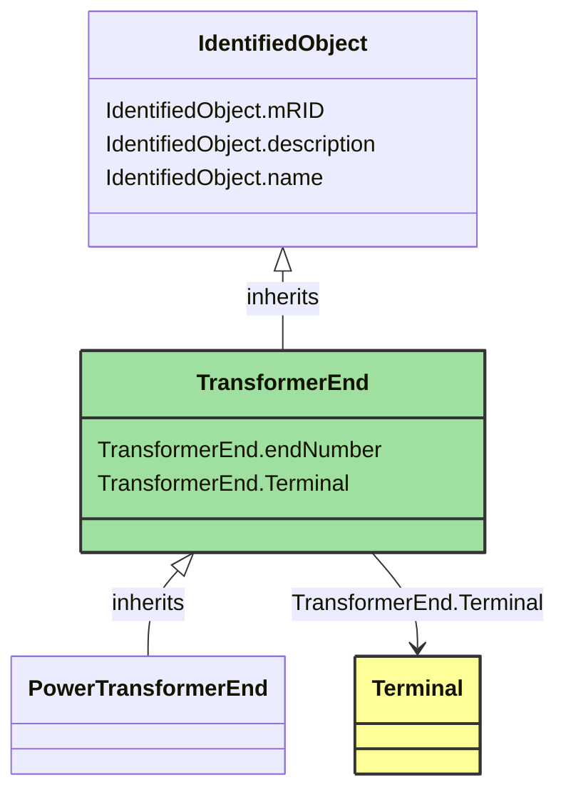

# TransformerEnd

_A conducting connection point of a power transformer. It corresponds to a physical transformer winding terminal.  In earlier CIM versions, the TransformerWinding class served a similar purpose, but this class is more flexible because it associates to terminal but is not a specialization of ConductingEquipment._

*__NOTE__: this is an abstract class and should not be instantiated directly

**URI**: [cim:TransformerEnd](https://cim.ucaiug.io/ns#TransformerEnd) 
**Type**: Class

## Inheritance
* [IdentifiedObject](IdentifiedObject.md)
    * **TransformerEnd**

## Attributes
| Name | URI | Cardinality and Range | Description | Inheritance |
| ---  | --- | --- | --- | --- |
| endNumber | [cim:TransformerEnd.endNumber](https://cim.ucaiug.io/ns#TransformerEnd.endNumber) | 0..1 Integer | Number for this transformer end, corresponding to the end's order in the power transformer vector group or phase angle clock number.  Highest voltage winding should be 1.  Each end within a power transformer should have a unique subsequent end number.   Note the transformer end number need not match the terminal sequence number. | direct |
| Terminal | [cim:TransformerEnd.Terminal](https://cim.ucaiug.io/ns#TransformerEnd.Terminal) | 0..1 Terminal | Terminal of the power transformer to which this transformer end belongs. | direct |
| mRID | [cim:IdentifiedObject.mRID](https://cim.ucaiug.io/ns#IdentifiedObject.mRID) | 0..1 string | Master resource identifier issued by a model authority. The mRID is unique within an exchange context. Global uniqueness is easily achieved by using a UUID, as specified in RFC 4122, for the mRID. The use of UUID is strongly recommended.For CIMXML data files in RDF syntax conforming to IEC 61970-552, the mRID is mapped to rdf:ID or rdf:about attributes that identify CIM object elements. | IdentifiedObject |
| description | [cim:IdentifiedObject.description](https://cim.ucaiug.io/ns#IdentifiedObject.description) | 0..1 [LanguageObject](LanguageObject.md) or string | The description is a free human readable text describing or naming the object. It may be non unique and may not correlate to a naming hierarchy. | IdentifiedObject |
| name | [cim:IdentifiedObject.name](https://cim.ucaiug.io/ns#IdentifiedObject.name) | 0..1 string | The name is any free human readable and possibly non unique text naming the object. | IdentifiedObject |

### Schema Source
* from schema: [https://ap-no.cim4.eu/WattApp/1.0](https://ap-no.cim4.eu/WattApp/1.0)
