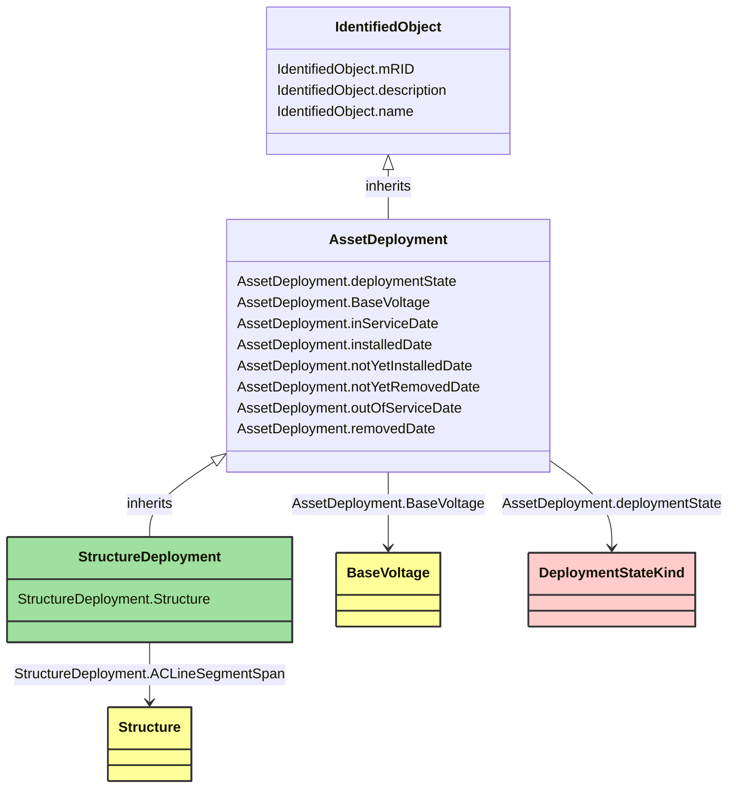

# StructureDeployment

_Deployment of a structure._

**URI**: [nc-no:StructureDeployment](http://cim4.eu/ns/nc-no#StructureDeployment) 
**Type**: Class

## Inheritance
* [IdentifiedObject](IdentifiedObject.md)
    * [AssetDeployment](AssetDeployment.md)
        * **StructureDeployment**

## Attributes
| Name | URI | Cardinality and Range | Description | Inheritance |
| ---  | --- | --- | --- | --- |
| ACLineSegmentSpan | [nc-no:StructureDeployment.Structure](http://cim4.eu/ns/nc-no#StructureDeployment.Structure) | 0..1 Structure | The associated Structure. | direct |
| deploymentState | [cim:AssetDeployment.deploymentState](https://cim.ucaiug.io/ns#AssetDeployment.deploymentState) | 0..1 DeploymentStateKind | Current deployment state of asset. | AssetDeployment |
| BaseVoltage | [cim:AssetDeployment.BaseVoltage](https://cim.ucaiug.io/ns#AssetDeployment.BaseVoltage) | 0..1 BaseVoltage | The associated Base Voltage. | AssetDeployment |
| inServiceDate | [nc-no:AssetDeployment.inServiceDate](http://cim4.eu/ns/nc-no#AssetDeployment.inServiceDate) | 0..1 datetime | Date and time asset was most recently put in service. | AssetDeployment |
| installedDate | [nc-no:AssetDeployment.installedDate](http://cim4.eu/ns/nc-no#AssetDeployment.installedDate) | 0..1 datetime | Date and time asset was most recently installed. | AssetDeployment |
| notYetInstalledDate | [nc-no:AssetDeployment.notYetInstalledDate](http://cim4.eu/ns/nc-no#AssetDeployment.notYetInstalledDate) | 0..1 datetime | Date and time of asset deployment transition to not yet installed. | AssetDeployment |
| notYetRemovedDate | [nc-no:AssetDeployment.notYetRemovedDate](http://cim4.eu/ns/nc-no#AssetDeployment.notYetRemovedDate) | 0..1 datetime | Date and time of asset deployment transition to not yet removed. | AssetDeployment |
| outOfServiceDate | [nc-no:AssetDeployment.outOfServiceDate](http://cim4.eu/ns/nc-no#AssetDeployment.outOfServiceDate) | 0..1 datetime | Date and time asset was most recently taken out of service. | AssetDeployment |
| removedDate | [nc-no:AssetDeployment.removedDate](http://cim4.eu/ns/nc-no#AssetDeployment.removedDate) | 0..1 datetime | Date and time asset was most recently removed. | AssetDeployment |
| mRID | [cim:IdentifiedObject.mRID](https://cim.ucaiug.io/ns#IdentifiedObject.mRID) | 0..1 string | Master resource identifier issued by a model authority. The mRID is unique within an exchange context. Global uniqueness is easily achieved by using a UUID, as specified in RFC 4122, for the mRID. The use of UUID is strongly recommended.For CIMXML data files in RDF syntax conforming to IEC 61970-552, the mRID is mapped to rdf:ID or rdf:about attributes that identify CIM object elements. | IdentifiedObject |
| description | [cim:IdentifiedObject.description](https://cim.ucaiug.io/ns#IdentifiedObject.description) | 0..1 string | The description is a free human readable text describing or naming the object. It may be non unique and may not correlate to a naming hierarchy. | IdentifiedObject |
| name | [cim:IdentifiedObject.name](https://cim.ucaiug.io/ns#IdentifiedObject.name) | 0..1 string | The name is any free human readable and possibly non unique text naming the object. | IdentifiedObject |

### Schema Source
* from schema: [https://ap-no.cim4.eu/AviationObstacle/1.0](https://ap-no.cim4.eu/AviationObstacle/1.0)
