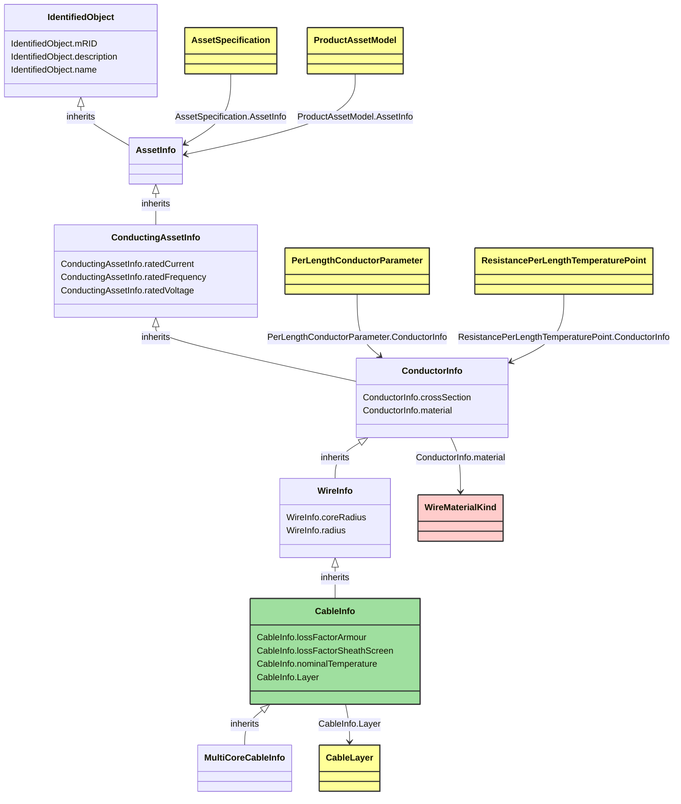

# CableInfo

_Cable data._

**URI**: [cim:CableInfo](http://iec.ch/TC57/CIM-generic#CableInfo) 
**Type**: Class

## Inheritance
* [IdentifiedObject](IdentifiedObject.md)
    * [AssetInfo](AssetInfo.md)
        * [ConductingAssetInfo](ConductingAssetInfo.md)
            * [ConductorInfo](ConductorInfo.md)
                * [WireInfo](WireInfo.md)
                    * **CableInfo**

## Attributes
| Name | URI | Cardinality and Range | Description | Inheritance |
| ---  | --- | --- | --- | --- |
| lossFactorArmour | [cim:CableInfo.lossFactorArmour](http://iec.ch/TC57/CIM-generic#CableInfo.lossFactorArmour) | 0..1 float | No description available | direct |
| lossFactorSheathScreen | [cim:CableInfo.lossFactorSheathScreen](http://iec.ch/TC57/CIM-generic#CableInfo.lossFactorSheathScreen) | 0..1 float | No description available | direct |
| nominalTemperature | [cim:CableInfo.nominalTemperature](http://iec.ch/TC57/CIM-generic#CableInfo.nominalTemperature) | 0..1 Temperature | Maximum nominal design operating temperature. | direct |
| Layer | [cim:CableInfo.Layer](http://iec.ch/TC57/CIM-generic#CableInfo.Layer) | 0..* CableLayer | No description available | direct |
| coreRadius | [cim:WireInfo.coreRadius](http://iec.ch/TC57/CIM-generic#WireInfo.coreRadius) | 0..1 Length | (if there is a different core material) Radius of the central core. | WireInfo |
| radius | [cim:WireInfo.radius](http://iec.ch/TC57/CIM-generic#WireInfo.radius) | 0..1 Length | Outside radius of the wire. | WireInfo |
| crossSection | [cim:ConductorInfo.crossSection](http://iec.ch/TC57/CIM-generic#ConductorInfo.crossSection) | 0..1 Area | Area of conducting material cross section | ConductorInfo |
| material | [cim:ConductorInfo.material](http://iec.ch/TC57/CIM-generic#ConductorInfo.material) | 0..1 WireMaterialKind | Conductor material. | ConductorInfo |
| ratedCurrent | [cim:ConductingAssetInfo.ratedCurrent](http://iec.ch/TC57/CIM-generic#ConductingAssetInfo.ratedCurrent) | 0..1 CurrentFlow | Rated current. | ConductingAssetInfo |
| ratedFrequency | [cim:ConductingAssetInfo.ratedFrequency](http://iec.ch/TC57/CIM-generic#ConductingAssetInfo.ratedFrequency) | 0..1 Frequency | Rated frequency such as 50Hz or 60Hz | ConductingAssetInfo |
| ratedVoltage | [cim:ConductingAssetInfo.ratedVoltage](http://iec.ch/TC57/CIM-generic#ConductingAssetInfo.ratedVoltage) | 0..1 Voltage | Rated voltage. | ConductingAssetInfo |
| mRID | [cim:IdentifiedObject.mRID](http://iec.ch/TC57/CIM-generic#IdentifiedObject.mRID) | 0..1 string | Master resource identifier issued by a model authority. The mRID is unique within an exchange context. Global uniqueness is easily achieved by using a UUID, as specified in IETF RFC 4122, for the mRID. The use of UUID is strongly recommended.For CIMXML data files in RDF syntax conforming to IEC 61970-552, the mRID is mapped to rdf:ID or rdf:about attributes that identify CIM object elements. | IdentifiedObject |
| description | [cim:IdentifiedObject.description](http://iec.ch/TC57/CIM-generic#IdentifiedObject.description) | 0..1 string | The description is a free human readable text describing or naming the object. It may be non unique and may not correlate to a naming hierarchy. | IdentifiedObject |
| name | [cim:IdentifiedObject.name](http://iec.ch/TC57/CIM-generic#IdentifiedObject.name) | 0..1 string | The name is any free human readable and possibly non unique text naming the object. | IdentifiedObject |

### Schema Source
* from schema: [http://iec.ch/TC57/2007/profile](http://iec.ch/TC57/2007/profile)
