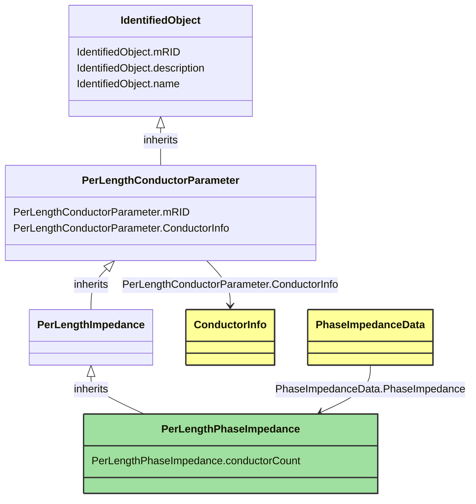

# PerLengthPhaseImpedance

_Impedance and admittance parameters per unit length for n-wire unbalanced lines, in matrix form._

**URI**: [cim:PerLengthPhaseImpedance](http://iec.ch/TC57/CIM-generic#PerLengthPhaseImpedance) 
**Type**: Class

## Inheritance
* [IdentifiedObject](IdentifiedObject.md)
    * [PerLengthConductorParameter](PerLengthConductorParameter.md)
        * [PerLengthImpedance](PerLengthImpedance.md)
            * **PerLengthPhaseImpedance**

## Attributes
| Name | URI | Cardinality and Range | Description | Inheritance |
| ---  | --- | --- | --- | --- |
| conductorCount | [cim:PerLengthPhaseImpedance.conductorCount](http://iec.ch/TC57/CIM-generic#PerLengthPhaseImpedance.conductorCount) | 0..1 integer | Number of phase, neutral, and other wires retained. Constrains the number of matrix elements and the phase codes that can be used with this matrix. | direct |
| mRID | [cim:PerLengthConductorParameter.mRID](http://iec.ch/TC57/CIM-generic#PerLengthConductorParameter.mRID) | 0..1 string | Master resource identifier issued by a model authority. The mRID is unique within an exchange context. Global uniqueness is easily achieved by using a UUID, as specified in IETF RFC 4122, for the mRID. The use of UUID is strongly recommended.For CIMXML data files in RDF syntax conforming to IEC 61970-552, the mRID is mapped to rdf:ID or rdf:about attributes that identify CIM object elements. | PerLengthConductorParameter |
| ConductorInfo | [cim:PerLengthConductorParameter.ConductorInfo](http://iec.ch/TC57/CIM-generic#PerLengthConductorParameter.ConductorInfo) | 0..1 ConductorInfo | No description available | PerLengthConductorParameter |
| mRID | [cim:IdentifiedObject.mRID](http://iec.ch/TC57/CIM-generic#IdentifiedObject.mRID) | 0..1 string | Master resource identifier issued by a model authority. The mRID is unique within an exchange context. Global uniqueness is easily achieved by using a UUID, as specified in IETF RFC 4122, for the mRID. The use of UUID is strongly recommended.For CIMXML data files in RDF syntax conforming to IEC 61970-552, the mRID is mapped to rdf:ID or rdf:about attributes that identify CIM object elements. | IdentifiedObject |
| description | [cim:IdentifiedObject.description](http://iec.ch/TC57/CIM-generic#IdentifiedObject.description) | 0..1 string | The description is a free human readable text describing or naming the object. It may be non unique and may not correlate to a naming hierarchy. | IdentifiedObject |
| name | [cim:IdentifiedObject.name](http://iec.ch/TC57/CIM-generic#IdentifiedObject.name) | 0..1 string | The name is any free human readable and possibly non unique text naming the object. | IdentifiedObject |

### Schema Source
* from schema: [http://iec.ch/TC57/2007/profile](http://iec.ch/TC57/2007/profile)
