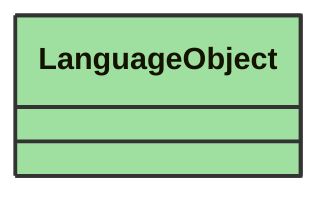

# LanguageObject

_An object that represents a jsonld compound to support value, type and language._

**URI**: [No URI available](No URI available) 
**Type**: Class

## Inheritance
* **LanguageObject**

## Attributes
| Name | URI | Cardinality and Range | Description | Inheritance |
| ---  | --- | --- | --- | --- |
| value | No URI available | 0..1 string | A string representing the GeoJSON object, typically serialized as a string. | direct |
| type | No URI available | 0..1 string | The type of the GeoJSON object, e.g., geo:geoJSONLiteral. | direct |

### Schema Source
* from schema: [https://ap-no.cim4.eu/WattApp/1.0](https://ap-no.cim4.eu/WattApp/1.0)
