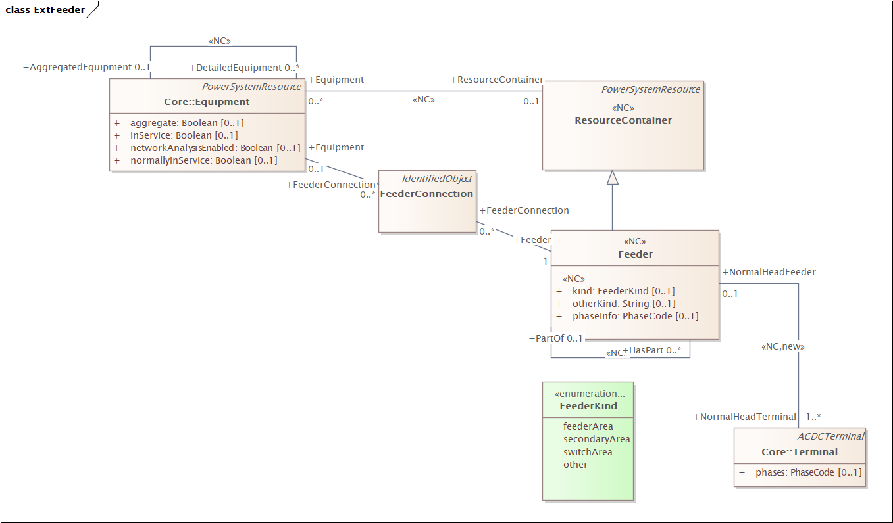
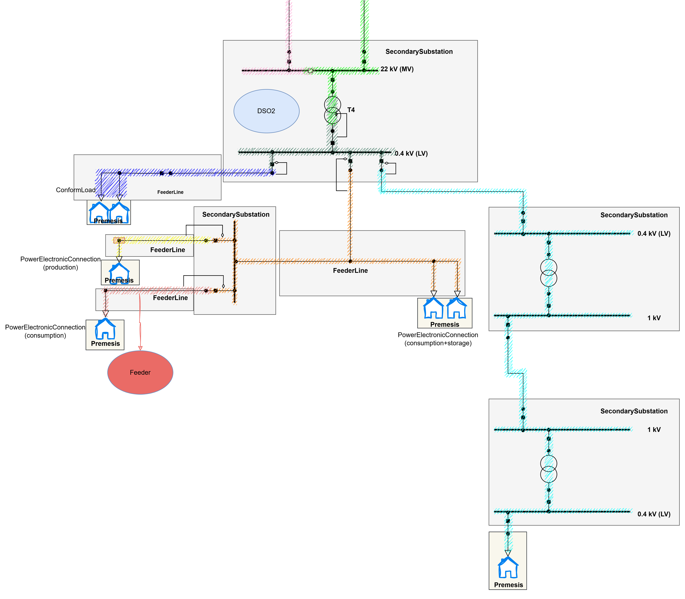

# CIM Feeder Model

## Overview

The Feeder model provides a **topology-based grouping** of equipment in the power system. Unlike the static container hierarchy (Substation → VoltageLevel → Bay → Line), which represents the physical structure and does not change with switching operations, the Feeder groups equipment based on **connectivity together with switch configuration** — i.e., which components are electrically fed by the same source.

A Feeder represents a radial circuit: all equipment that is energized from a single source point (typically a Bay or PowerTransformer) under a given switching state. This makes Feeder inherently dynamic — the same physical grid can have different Feeder groupings depending on whether switches are in normal, open, or simulated configurations.

### Key Distinction: Containers vs. Feeders

| Aspect | Container (Substation, VoltageLevel, Bay, Line) | Feeder |
|--------|--------------------------------------------------|--------|
| Basis | Physical/structural ownership | Electrical connectivity + switch state |
| Stability | Static — does not change with switching | Dynamic — changes with switch configuration |
| Purpose | Physical grouping | Electrical grouping |
| Overlap | Equipment belongs to exactly one container | Equipment can belong to multiple Feeders |

## Classes



### Feeder

**Description:** A topology-based grouping of equipment that is electrically connected and fed from a common source point under a specific switch configuration. Represents a radial circuit where all members are energized from the same Bay or PowerTransformer.

**Attributes:**

| name | mult | type | description |
|------|------|------|-------------|
| kind | 0..1 | FeederKind | Classification of the feeder type |
| otherKind | 0..1 | String | Free-text description when kind = "other" |
| phaseInfo | 0..1 | PhaseCode | Phase information for the feeder |
| aggregate | 0..1 | Boolean | inherited from: Equipment |
| normallyInService | 0..1 | Boolean | inherited from: Equipment |
| description | 0..1 | String | inherited from: IdentifiedObject |
| mRID | 1..1 | String | inherited from: IdentifiedObject |
| name | 1..1 | String | inherited from: IdentifiedObject |

**Relationships:**

| mult from | name | mult to | type | description |
|-----------|------|---------|------|-------------|
| 0..* | FeederConnection | 1 | FeederConnection | Connections linking equipment to this feeder |
| 1 | NormalHeadTerminal | 1..* | Terminal | The terminal(s) at the head of this feeder in normal configuration |
| 0..* | NormalHeadFeeder | 0..1 | Feeder | Parent feeder in normal switching state |
| 0..1 | HasPart | 0..* | Feeder | Child feeders nested within this feeder |
| 0..* | PartOf | 0..1 | Feeder | Parent feeder containing this feeder |

---

### FeederConnection

**Description:** An association class that links Equipment to Feeders. This enables many-to-many relationships — the same equipment can participate in multiple feeders (representing different switch configurations), and a feeder can contain multiple pieces of equipment.

**Relationships:**

| mult from | name | mult to | type | description |
|-----------|------|---------|------|-------------|
| 0..* | Equipment | 0..* | Equipment | Equipment included in this connection |
| 0..* | Feeder | 0..* | Feeder | Feeders this connection belongs to |

---

### FeederKind (Enumeration)

**Description:** Classifies the type of feeder.

| Value | Description |
|-------|-------------|
| feederArea | A primary feeder area — typically the full radial circuit from a bay |
| secondaryArea | A secondary/sub-area within a larger feeder |
| switchArea | A grouping defined by switch boundaries |
| other | Other classification (use `otherKind` for description) |

## Feeder Nesting (Hierarchical Grouping)

Feeders can be nested hierarchically using the **PartOf / HasPart** self-association:

- A top-level Feeder might represent the entire circuit fed from a PowerTransformer
- Child Feeders can split this by individual Bays in a substation
- Further subdivision can separate Medium Voltage from Low Voltage sections

**Example hierarchy:**

```
Feeder: "Transformer T1 Circuit" (kind: feederArea)
├── Feeder: "Bay B1 MV Feeder" (kind: switchArea)
│   ├── Feeder: "LV Feeder from SecSub 101" (kind: secondaryArea)
│   └── Feeder: "LV Feeder from SecSub 102" (kind: secondaryArea)
└── Feeder: "Bay B2 MV Feeder" (kind: switchArea)
    └── Feeder: "LV Feeder from SecSub 103" (kind: secondaryArea)
```

## Equipment Membership in Multiple Feeders

Unlike containers where equipment belongs to exactly one parent, the FeederConnection association allows equipment to belong to **multiple Feeders simultaneously**. This is essential because:

1. **Normal vs. operational configurations:** A switching configuration can vary depending on the operational situation and we want to be able to switch between these configurations when needed
2. **Simulation scenarios:** When exploring "what if" configurations, equipment may be grouped differently
3. **Open switches included:** A feeder representing a circuit must include the open switches at its boundaries to fully describe the topology

## Use Cases

### 1. Generate Reduced Equipment Files

Create CIM/XML export files containing only the equipment in a specific feeder, rather than exporting the entire grid model. This is useful for:

- Sharing a subset of the grid with external systems or partners
- Reducing file sizes for targeted analysis tools
- **Note:** These files must include open switches at the feeder boundary to correctly represent the circuit extent

### 2. Outage Impact Analysis

Determine which equipment and customers lose power if a specific Transformer or Bay fails:

- Query the Feeder fed by that source to get all affected equipment
- Identify alternative sources by finding open switches at feeder boundaries that could be closed to restore supply from an adjacent feeder
- Quickly visualize the affected area on a map

### 3. Sharing Simulation Configurations

After running a simulation with a specific switch configuration, persist the resulting equipment grouping as a Feeder:

- A colleague can load the same Feeder definition to reproduce or review the simulation
- The Feeder captures exactly which components were included, avoiding the need to recalculate connectivity

### 4. Pre-computed Topology for Performance

Store the grouping for different grid configurations instead of recalculating connectivity every time:

- Only recompute when a topology change occurs (switch operation, new equipment commissioning)
- Dramatically reduces computation for downstream applications that need to know "what feeds what"

### 5. Simple Aggregation and Equivalent Injection Scope

Use Feeder to define the scope of an aggregation:

- While `EquivalentInjection` is the preferred class for storing aggregated calculation results, the Feeder can define *which* equipment is aggregated
- Provides an easy approach to show what has been collapsed into an EquivalentInjection
- Useful for load flow summaries at feeder level

> **Open question:** There is currently no direct relationship between EquivalentInjection and Feeder in the CIM model. Possible workarounds include naming conventions or placing the EquivalentInjection at the same ConnectivityNode as the Feeder head terminal. Whether a formal association should be introduced (or the EquivalentInjection included in the Feeder via FeederConnection) is unresolved. In this use case NormalHeadTerminal can be very useful to determine the link between EquivalentInjection and Feeder

### 6. Protection Zone Mapping

Map protection relay zones to feeders:

- A protection device at a bay protects the equipment in its downstream feeder
- Feeder membership makes it straightforward to determine which equipment is within a protection zone
- Supports coordination studies by clearly defining zone boundaries

> **TODO:** Emilie needs to talk to her "Vern" specialist friend to validate this use case.

### 7. Filtered Class Queries from Feeder Membership

Since the Feeder already contains the full set of connected equipment, you can filter by CIM class to answer targeted questions without recalculating topology:

- "Give me all ConformLoads that will lose power if this transformer fails" — simply filter the Feeder's equipment by class type
- Works for any class: find all ACLineSegments or Switches in a Feeder
- Avoids expensive graph traversal when you only need a subset of the equipment
- Lowers the competence barrier — graph traversal with connectivity and switch state logic is complex and requires extensive training, while filtering a pre-computed Feeder is a simple query anyone can perform

### 8. Capacity Calculation — How Much Can We Add to This Feeder?

Determine the remaining capacity on a feeder to answer the question: "How much additional load (or generation) can we connect before hitting thermal, voltage, or protection limits?"

The Feeder provides the natural scope for this calculation:

- **Equipment inventory from Feeder membership:** All ACLineSegments, PowerTransformers, and Switches in the feeder are already known — their rated capacities (ratedS, ratedCurrent) define the physical constraints
- **Existing load baseline:** Filter the Feeder's equipment for EnergyConsumers / ConformLoads to get the current committed load. If EquivalentInjections exist at the feeder head, use those as aggregated baselines
- **Bottleneck identification:** The weakest link in the feeder (lowest-rated cable segment or transformer) determines the ceiling. Feeder membership gives you the full chain from head terminal to endpoints without graph traversal
- **Headroom calculation:** Compare the sum of existing loads against the bottleneck capacity to derive available headroom in kW/kVA
- **Location-aware capacity:** By leveraging feeder nesting (child feeders / switchAreas), you can pinpoint *where* in the feeder capacity remains — e.g., "SecSub 101 LV feeder has 50 kW headroom, but SecSub 102 is full"

**Practical application for Norwegian DSOs:**

When a customer applies for a new connection or increased capacity ("tilknytningsforespørsel"), the DSO must quickly determine if the existing grid can handle it. Today this often requires manual analysis by a specialist. With a pre-computed Feeder containing all relevant equipment and ratings, a system can:

1. Look up the Feeder serving the requested connection point
2. Sum existing committed capacity (loads + already-approved-but-not-yet-connected)
3. Compare against rated capacity of the constraining element
4. Return a yes/no/conditional answer with the limiting component identified

**Thoughts and considerations:**

- This use case benefits heavily from **Use Case 4 (Pre-computed Topology)** — the feeder membership must already be established so that capacity queries are fast lookups, not on-the-fly topology calculations
- The CIM model today does not standardize how to store "committed but not yet connected" capacity. This is a gap — DSOs track approved connections that haven't materialized yet, and these consume capacity. A possible approach is to model these as EnergyConsumers with a status attribute (e.g., `planned`) included in the Feeder via FeederConnection
- Voltage drop constraints are harder to derive from membership alone — they require impedance values on each ACLineSegment and the position along the feeder. The Feeder provides the *scope*, but actual voltage drop calculation still needs the connectivity ordering (which terminal connects to which). The NormalHeadTerminal gives the starting point, and the ConnectivityNode chain within the feeder gives the path
- For generation (solar, battery), the same logic applies in reverse: how much generation can be added before reverse power flow causes voltage rise issues at the feeder extremities
- This use case makes Feeder nesting particularly valuable — a transformer feeder might have 500 kVA headroom overall, but a specific LV sub-feeder downstream might be constrained to 20 kW by a thin cable section

> **Open question:** Should capacity calculation results (headroom, limiting element) be persisted as attributes on the Feeder itself, or stored externally and linked by mRID? Persisting on the Feeder risks staleness, but external storage requires a lookup convention.

### 9. Local Frequency Balancing and Flexibility Bidding — Feeder as Distribution Zone?

With the evolving DSO role ("distribusjonsnettoperatør"), distributed utilities will take on responsibility for local frequency balance and must participate in flexibility markets through bidding. This raises the question: can the Feeder serve as the geographic/electrical zone for a Scheduling Area in the distribution grid?

**The proposition:** Use Feeder membership to define the distribution-level zone within which flexibility resources (batteries, controllable loads, DER) are aggregated for bidding purposes. The capacity calculation from Use Case 8 feeds directly into this — knowing the headroom per feeder tells you how much flexibility you can activate without violating grid constraints.

**Why Feeder is NOT the right abstraction for this:**

Feeder is fundamentally too high-resolution for scheduling and bidding purposes:

- A single Scheduling Area in the transmission grid can encompass an entire region. At distribution level, an equivalent concept would span **several hundred Feeders**. Mapping one Feeder to one bidding unit creates unmanageable granularity for market operations
- Feeder is designed around *operational switching* — how you split and reconfigure the grid based on load optimization, voltage management, earthing grid considerations, short-circuit levels, and protection coordination. These are real-time operational concerns, not market scheduling concerns
- The switching-based nature of Feeder means its membership is dynamic. A Scheduling Area must be stable over market time horizons (day-ahead, intraday) — you cannot have your bidding zone boundaries shift because someone opened a sectionalizer
- Bidding requires aggregation at a level where the market can clear meaningfully. Individual feeders are too small to represent tradeable flexibility volumes in most cases

**The correct approach — use transmission-level market classes:**

The CIM already has well-established classes for market topology in IEC 62325 (Market Operations):

| Class | Role in distribution context |
|-------|------------------------------|
| **SchedulingArea** | The operational area where a DSO balances supply/demand — likely maps to a primary substation or group of substations |
| **BiddingZone** | The market area where flexibility bids are submitted — could be the entire DSO concession area or a subdivision |
| **GridPowerCapacity** | The available transfer capacity at zone boundaries — critical for knowing how much flexibility can flow between areas |
| **CapacityCalculationRegion** | The region over which capacity calculations are coordinated — groups multiple SchedulingAreas |
| **BiddingZoneBorder** | The interconnection between bidding zones — where transfer constraints apply |

These classes provide the right level of abstraction: stable geographic boundaries, appropriate granularity for market clearing, and alignment with how the transmission grid already operates.

**How Feeder still contributes (indirectly):**

While Feeder should not *be* the Scheduling Area, the feeder-level capacity calculations from Use Case 8 are essential *inputs* to the Scheduling Area:

- Aggregate headroom across all feeders within a SchedulingArea to determine total available flexibility
- Identify which feeders are constrained (bottlenecks that limit how much flexibility can be activated even if market signals request it)
- Use feeder-level data to validate that a cleared bid is actually deliverable without causing local violations

**Suggested model relationship:**

```
BiddingZone (DSO concession area or sub-area)
└── SchedulingArea (primary substation or group of substations)
    └── contains hundreds of Feeders (via SubGeographicalRegion or similar grouping)
        └── Feeder-level capacity feeds into SchedulingArea constraints
```

> **Recommendation:** Do NOT overload Feeder with market semantics. Keep Feeder for what it does well — operational topology grouping. Introduce SchedulingArea and BiddingZone at distribution level using the same IEC 62325 classes used in transmission, adapted for DSO scale. The link between them is that feeder-level physics (capacity, voltage, thermal limits) constrains what the SchedulingArea can offer to the market.

> **Open question:** How should the grouping of Feeders into a SchedulingArea be modelled? Options include SubGeographicalRegion, a custom association, or simply geographic containment. The CIM does not currently prescribe how distribution-level assets roll up into market zones.

## Norwegian Extensions

In the Norwegian CIM profile (CIM4No / NoCIMExtensions):

- Feeder is used to model the radial distribution network structure common in Norwegian grids
- The `NormalHeadTerminal` relationship connects the feeder to the source terminal (typically at the bay breaker in a substation)
- Norwegian DSOs use Feeder to represent "avganger" (outgoing feeders) from substations and secondary substations
- The nesting capability supports the Norwegian practice of modelling separate MV and LV feeder areas

## Relationship to Static Containers

Feeder complements but does not replace the static container hierarchy:

| Concept | Role |
|---------|------|
| **Substation / VoltageLevel / Bay** | Physical structure — where equipment is installed |
| **Line / FeederLine** | Physical cable/line ownership — which line segment belongs where |
| **Feeder** | Electrical grouping — what is connected under a switch state |

Equipment always has exactly one static container (e.g., a switch is in a Bay), but may be referenced by zero or more Feeders depending on the modelled configurations.

## Model Justification

### Why FeederConnection exists

The FeederConnection class was introduced to avoid a direct many-to-many relationship between Equipment and Feeder. As described in the use cases above, there are several reasons why an equipment must be able to participate in more than one Feeder (e.g., different network configurations, boundary equipment, simulations).

### Feeder self-association (PartOf / HasPart)

Equipment being associated with several feeders should not be confused with a sub-feeder being a part of a feeder. The PartOf relationship between feeders is used to model functional units that are supplied from the same source but should be distinguished for practical purposes.

### Feeder–Terminal association (NormalHeadTerminal)

Each Feeder should point to at least one Terminal to indicate where in the connectivity model it is supplied from. It is allowed to point to several Terminals to support cases where more than one ConductingEquipment serves as a logical starting point.

### Feeder illustration

The below illustration exemplifies how Feeder can be used to group equipment, including the use of feeder self-association and equipment being part of several feeders.



## Modeling Guide

### Switch to Feeder connection

Switches contained in a feeder Bay should be connected to the same Feeder as the BusbarSection they are connected to, not the ACLineSegment.

## References

- IEC 61970-301 — CIM Base (defines Feeder as EquipmentContainer)
- [3lbits/cim4no](https://github.com/3lbits/cim4no) — Norwegian CIM profile
- [3lbits/NoCIMExtensions](https://github.com/3lbits/NoCIMExtensions) — Norwegian CIM Extensions
- [3lbits/CIM4NoUtility](https://github.com/3lbits/CIM4NoUtility) — CIM4No Utility tools
